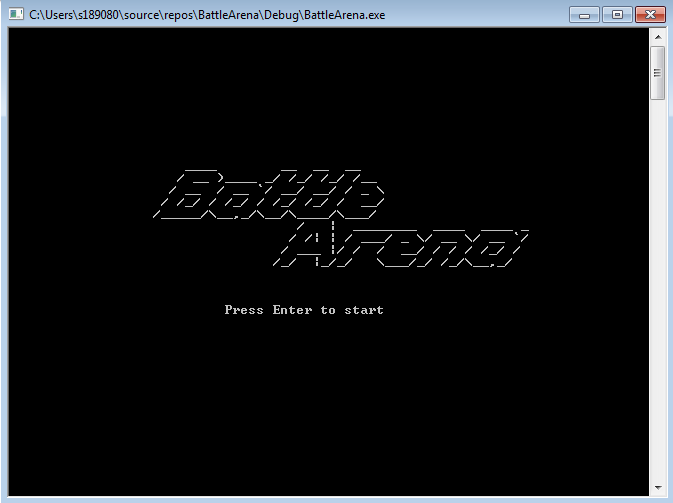
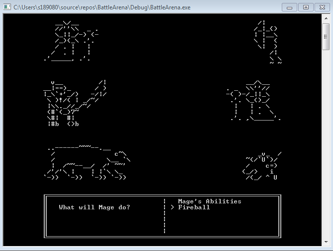
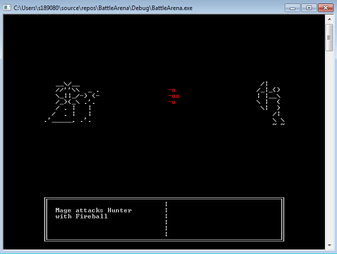

## Battle Arena
PVP Battle Arena on Windows Console

Assesment for Introduction to C++

## General Description
This is a game or simulation that consists of two teams of opposing forces.

The forces must be implemented as Class objects stored within two separate arrays. The objects must contain health values.

Each turn consists of the forces fighting each other, inflicting damage to one another in some way.

Once the turn has finished the forces (in the arrays) are to be sorted using a sorting algorithm of your choice that will sort the force according to the remaining health of each member.

The game or simulation continues its turns until all members within a force are dead, which results in a win for the force still living.

You may implement this game however you wish, either as two-player, one-player, or automated simulation, but it must make use of two arrays of custom Class objects that are sorted each turn.

## Requirements
A custom class is used to instantiate members of each force

The class stores a health variable, in addition to other information

The game contains two arrays, each containing instances of the custom class. These arrays make up the opposing forces.
During each turn, members of each force must ‘fight’. Upon completion of each turn the members of each force are sorted according to health.

When all members of a force have been defeated, a game-over message is displayed.

## My Implementation

